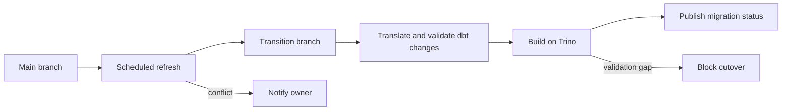

# Warehouse-to-Lakehouse Migration

## ⚡ What Changed

Migrated a 200+ TB Redshift warehouse with 2,000+ dbt-modeled objects to a
Trino/Starburst query layer backed by Apache Iceberg tables. The migration kept
existing BI, analytics, and downstream jobs stable through a hot-swap cutover
instead of repeated consumer repointing.

Core outcomes:

- 100% object parity for cutover scope
- roughly 60% lower platform cost
- automated translation, branch freshness, dependency, and validation controls
- production changes continued on `main` while lakehouse changes moved through a
  transition branch

## 🧭 Target Architecture


## 📊 Migration Tracker

The Tableau tracker was the control plane for migration status by schema,
folder, object, owner, and cutover requirement.


🔗 [migration_tracker.sql](tableau-migration-tracker/migration_tracker.sql)

## 🔄 dbt Translation Layer

The dbt migration was not just a connection-profile change. Redshift-specific
model config, SQL syntax, source routing, and incremental behavior had to be
made compatible with Trino/Iceberg.

### Processor

🔗 [dbt_jinja_processor.py](translation-engine/dbt_jinja_processor.py)

The processor handles the model-file cleanup work:

- removes Redshift-only dbt config such as `dist`, `sort`, `distkey`, and
  `sortkey`,
- preserves dbt/Jinja constructs such as `ref`, `source`, `var`, and
  `dbt_utils`,
- removes incremental-only SQL blocks when a migrated object is intentionally
  rebuilt as a view,
- keeps the model reviewable so the translated SQL can be compiled and checked
  against Trino before cutover.

### Config Cleanup

<table>
  <thead>
    <tr>
      <th>Redshift model config</th>
      <th>Trino/Iceberg model config</th>
    </tr>
  </thead>
  <tbody>
    <tr>
      <td>
<pre><code class="language-jinja">{{ config(
    materialized='incremental',
    unique_key='payment_id',
    dist='company_id',
    sort=['created_at']
) }}</code></pre>
      </td>
      <td>
<pre><code class="language-jinja">{{ config(
    materialized='incremental',
    unique_key='payment_id'
) }}</code></pre>
      </td>
    </tr>
  </tbody>
</table>

The cleanup keeps logical dbt behavior and removes Redshift physical layout
settings that do not apply to Iceberg tables.

### Deterministic Function Translation

Function and syntax translations were handled deterministically. A few common
rewrites:

| Redshift | Trino |
| --- | --- |
| `GETDATE()` | `CURRENT_TIMESTAMP` |
| `NVL(a, b)` | `COALESCE(a, b)` |
| `DATEADD(day, x, y)` | `DATE_ADD('day', x, y)` |
| `x::BIGINT` | `CAST(x AS BIGINT)` |
| `LEN(str)` | `LENGTH(str)` |

🔗 Full mapping:
[redshift-to-trino-function-mapping.md](translation-engine/redshift-to-trino-function-mapping.md)

### Source Routing

During transition, some models still read from the warehouse while others read
from the lakehouse. A migration-aware relation macro made that routing explicit.

```jinja

    
        {{ return(source('lakehouse', schema_name ~ '__' ~ table_name)) }}
    
        {{ return(source('warehouse', schema_name ~ '__' ~ table_name)) }}
    

```

Then models used the migration-aware relation:

```sql
SELECT
    payment_id,
    company_id,
    amount,
    created_at
FROM {{ migration_relation('finance', 'payments') }}
```

## 🔁 GitLab Transition Branch

The migration used a long-running transition branch so production work could
continue on `main` while Trino/Iceberg changes were translated and validated.



🔗 [transition_branch_refresh.py](gitlab-autorebase-transition-branch/transition_branch_refresh.py)  
Runs the branch refresh. It checks for a clean CI worktree, configures the
automation git identity, fetches remote branches, resets the transition branch
to its remote state, then rebases or merges it onto `main`. If the refresh
conflicts, it collects the conflicting file list and sends a Slack notification
through `SLACK_WEBHOOK_URL`.

🔗 [gitlab-ci.transition-branch-refresh.yml](gitlab-autorebase-transition-branch/gitlab-ci.transition-branch-refresh.yml)  
Configures the scheduled GitLab job. It runs in a Python image, installs `git`
and `requests`, keeps full git history with `GIT_DEPTH: "0"`, and only runs for
scheduled pipelines where `RUN_TRANSITION_BRANCH_REFRESH=true`.
