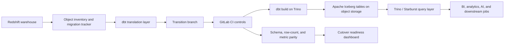

# Redshift to Trino + Iceberg Lakehouse Migration

This is a portfolio-style technical case study for a large warehouse-to-lakehouse
migration. It consolidates the migration story, shift-left controls, GitLab
branch workflow, dbt SQL translation patterns, and parity validation logic into
one public-safe project.

This is not an installable library. The files here are documentation and
anonymized examples that show how I think through a production-scale data
platform migration.

## Impact

- Migrated a 200+ TB Redshift warehouse to a Trino/Starburst query layer backed
  by Apache Iceberg tables.
- Replatformed 2K+ dbt-modeled objects while preserving object-level parity.
- Built automated schema, row-count, and metric parity checks before consumer
  cutover.
- Used a shift-left workflow so translation, freshness, dependency, and parity
  issues were caught in GitLab before production users depended on the new
  lakehouse objects.
- Reduced platform cost by roughly 60% while keeping existing BI and analytics
  workflows stable.

## Migration Architecture



## Visual Walkthrough

The screenshots below are anonymized portfolio visuals. They show how the
migration story can be reviewed from architecture, execution tracking, adoption,
and runtime-performance angles.

### Cutover architecture


### Migration control plane


### Adoption signal


### Runtime impact


## What This Project Showcases

| Area | What is represented |
| --- | --- |
| Lakehouse architecture | Redshift to Trino/Starburst over Iceberg and object storage |
| Migration control plane | Object inventory, status tracking, folder/schema progress, cutover readiness |
| dbt translation | Custom template patterns for Redshift-to-Trino SQL and config migration |
| GitLab workflow | Long-lived transition branch refresh, branch freshness checks, scheduled jobs |
| Shift-left quality | Compile, parse, dependency, config, ownership, and parity checks before merge |
| Data validation | Schema parity, row-count parity, type normalization, metric comparison |
| Operations | Iceberg maintenance, table statistics, query usage, and runtime observability |

## Repository Structure

```text
README.md
assets/
  adoption-active-users.png
  job-duration-post-cutover.png
  migration-progress-dashboard.png
  warehouse-lakehouse-architecture.png
docs/
  technical-deep-dive.md
  shift-left-controls.md
  presentation-addendum.md
diagrams/
  warehouse_to_lakehouse_flow.mmd
  gitlab_shift_left_flow.mmd
examples/
  dbt_sql_translation.md
  dbt_translation_engine/
    README.md
    dbtJINJAProcessor.ipynb
  gitlab-ci.transition-branch-refresh.yml
  migration_tracker.sql
  parity_validation.py
  transition_branch_refresh.py
```

## Technical Components

### 1. Migration tracker

The migration tracker compares the known Redshift/dbt object inventory against
the Iceberg/Trino catalog and produces a migration status table.

See [examples/migration_tracker.sql](examples/migration_tracker.sql).

### 2. dbt SQL translation layer

The translation layer standardizes Redshift-specific SQL and dbt config into
Trino-compatible patterns. The point is not simple find-and-replace. The safer
pattern is:

- render dbt/Jinja first,
- normalize unsupported Redshift config,
- route table references through a migration-aware template,
- parse rendered SQL with a SQL AST parser,
- fail CI when the translated model cannot compile or parse.

See [examples/dbt_sql_translation.md](examples/dbt_sql_translation.md).

### 3. GitLab transition branch management

A long-running transition branch lets the team convert models while `main`
continues to receive normal business changes. Scheduled refresh keeps the
transition branch close to the main branch and surfaces conflicts early.

See [examples/transition_branch_refresh.py](examples/transition_branch_refresh.py)
and [examples/gitlab-ci.transition-branch-refresh.yml](examples/gitlab-ci.transition-branch-refresh.yml).

### 4. Parity validation

The validation layer compares source and target objects before cutover:

- source object exists in target catalog,
- schemas and columns match,
- compatible data types are normalized,
- row counts match within tolerance,
- curated business metrics match within tolerance,
- missing columns are risk-scored based on non-null data presence.

See [examples/parity_validation.py](examples/parity_validation.py).

## Presentation Companion

The slide deck tells the executive story. The missing technical depth belongs in
a technical appendix:

- migration control plane,
- GitLab branch strategy,
- dbt template translation engine,
- CI quality gates,
- parity validation,
- operational cutover and rollback.

See [docs/presentation-addendum.md](docs/presentation-addendum.md).
