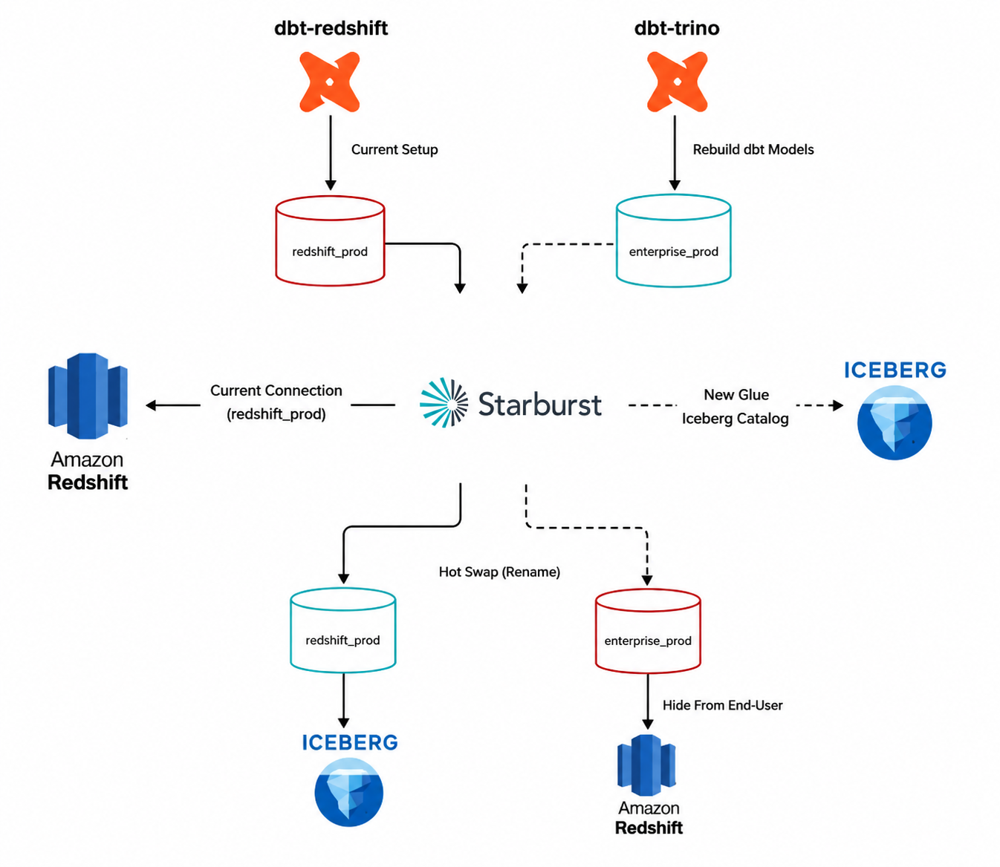
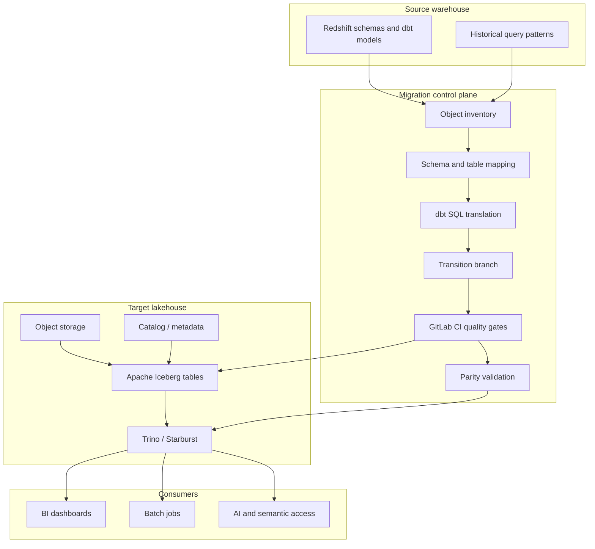
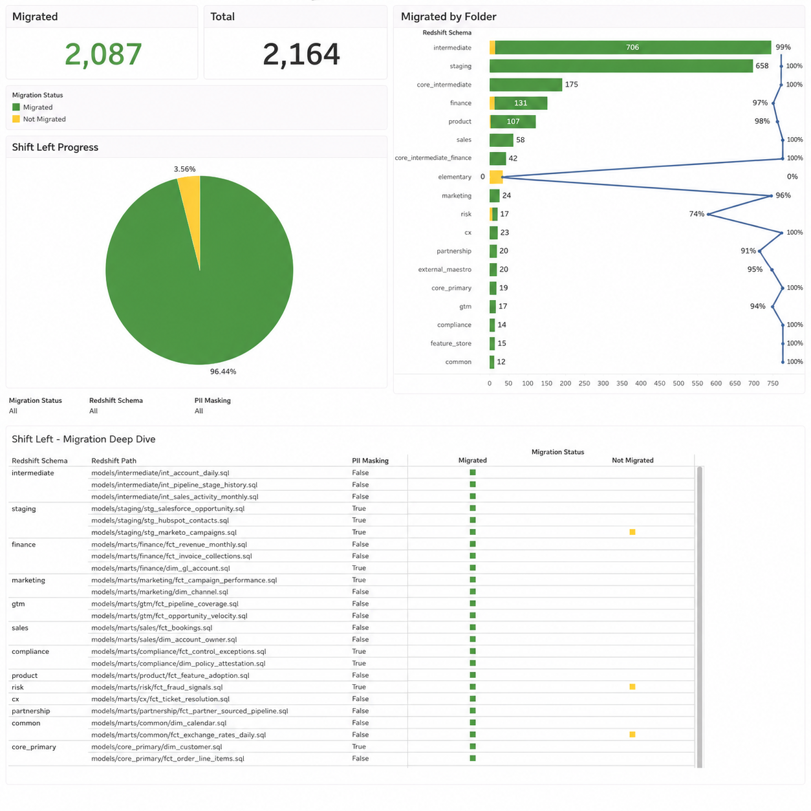
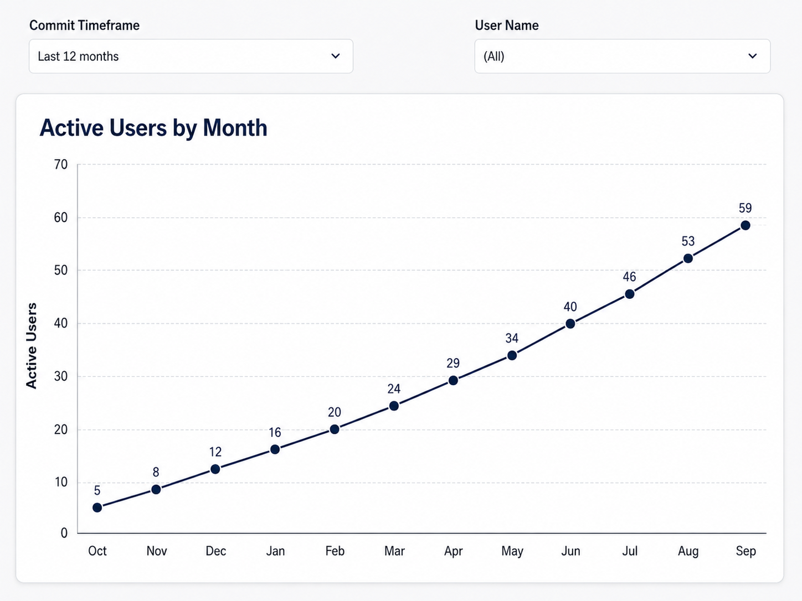
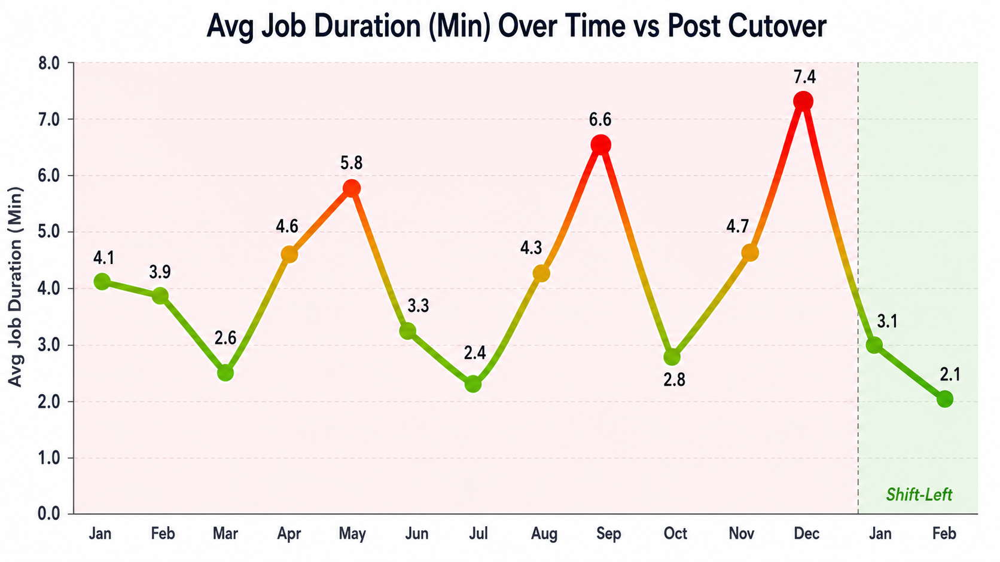

# Redshift to Trino + Apache Iceberg Lakehouse Migration

This repository documents a warehouse-to-lakehouse migration pattern: Redshift
models and workloads were moved behind a Trino/Starburst query layer backed by
Apache Iceberg tables.

The hard part was not only moving data. The hard part was keeping thousands of
modeled objects, downstream dependencies, and business metrics stable while the
platform changed underneath them.

The migration system had four parts:

1. A control plane that tracked which objects had moved.
2. A dbt translation layer that converted Redshift-oriented code to
   Trino/Iceberg-compatible code.
3. GitLab branch and CI controls that caught migration problems before merge.
4. Automated parity checks that proved readiness before cutover.

All examples are anonymized and intentionally kept as readable implementation
patterns instead of an installable package.

## Target Architecture





## Migration Control Plane

The migration tracker created a single source of truth for object progress. It
joined the source warehouse/dbt inventory to the target Iceberg catalog and
classified each object as migrated or not migrated.



The tracker supported progress by schema or folder, object-level cutover status,
dashboard counts, high-usage object prioritization, and exception handling for
intentionally retired objects.

```sql
CASE
    WHEN t.target_table IS NOT NULL THEN 'migrated'
    WHEN m.is_required_for_cutover THEN 'required_not_migrated'
    ELSE 'optional_not_migrated'
END AS migration_status
```

Full example: [examples/migration_tracker.sql](examples/migration_tracker.sql)

## dbt Translation Layer

Changing the connection profile from Redshift to Trino was not enough. The code
migration needed deterministic handling for known SQL dialect and adapter
differences.

| Redshift-oriented pattern | Trino/Iceberg migration concern |
| --- | --- |
| `dist`, `sort`, `distribution` configs | Not valid or not useful for Trino/Iceberg |
| Redshift date functions | Function signatures differ in Trino |
| `::type` casts | Prefer explicit `CAST(expr AS type)` |
| warehouse-specific schemas | Need migration-aware source routing |
| table rebuild assumptions | Iceberg has snapshot and maintenance behavior |
| incremental model strategy | Adapter-specific merge/delete behavior differs |

The translation layer rendered dbt/Jinja first, governed config keys, routed
source references through migration-aware mappings, translated known dialect
patterns, and parsed the rendered SQL before build.

```jinja
{{ config(
    materialized='incremental',
    unique_key='payment_id',
    on_schema_change='sync_all_columns'
) }}
```

```jinja

    
        {{ return(source('lakehouse', schema_name ~ '__' ~ table_name)) }}
    
        {{ return(source('warehouse', schema_name ~ '__' ~ table_name)) }}
    

```

Examples:

- [examples/dbt_sql_translation.md](examples/dbt_sql_translation.md)
- [examples/dbt_translation_engine/README.md](examples/dbt_translation_engine/README.md)
- [examples/dbt_translation_engine/dbtJINJAProcessor.ipynb](examples/dbt_translation_engine/dbtJINJAProcessor.ipynb)

## GitLab Transition Branch Strategy

The migration used a long-running transition branch to isolate platform changes
without freezing normal development. `main` continued to receive production
changes while the migration branch translated and validated models against the
lakehouse target.

The scheduled refresh job kept the transition branch close to `main` and
surfaced conflicts early.

```python
run(["git", "fetch", remote, "--prune"])
run(["git", "checkout", transition_branch])
run(["git", "reset", "--hard", f"{remote}/{transition_branch}"])
run(["git", "rebase", f"{remote}/{target_branch}"])
run(["git", "push", "--force-with-lease", remote, transition_branch])
```

The CI workflow checked branch freshness, unsupported config keys, dependency
rules, SQL rendering/parsing, dbt build output, and parity results before
cutover.

Examples:

- [docs/shift-left-controls.md](docs/shift-left-controls.md)
- [examples/transition_branch_refresh.py](examples/transition_branch_refresh.py)
- [examples/gitlab-ci.transition-branch-refresh.yml](examples/gitlab-ci.transition-branch-refresh.yml)

## Parity Validation

The validation layer compared source and target objects before downstream
consumers were moved. The goal was to prove object parity before cutover, not
discover issues after dashboards or jobs had already moved.

Validation categories:

- object existence,
- column existence,
- data type compatibility,
- row-count parity,
- metric parity,
- missing-column risk based on non-null values,
- known-system-column exclusions.

```python
def normalize_dtype(dtype: str | None) -> str | None:
    if dtype is None or pd.isna(dtype):
        return None

    value = str(dtype).lower().strip()
    if "timestamp" in value:
        return "timestamp"
    value = re.sub(r"varchar\(\d+\)", "varchar", value)
    value = re.sub(r"decimal\([\d,\s]+\)", "decimal", value)
    return value
```

Full example: [examples/parity_validation.py](examples/parity_validation.py)

## Cutover Signals

The migration was treated as complete only when the target platform was usable
and stable for downstream consumers.



Runtime behavior was also tracked after cutover. This helped separate data
correctness from operational readiness.



## Operational Follow-Through

After objects landed in Iceberg, the platform still needed maintenance and
observability:

- collect table statistics for Trino planning,
- monitor query usage and table access,
- identify stale or unused objects,
- run Iceberg maintenance such as snapshot expiration and file compaction,
- validate runtime behavior through Airflow/MWAA jobs.

This turns the migration from a one-time movement of data into a durable
lakehouse operating model.

## Repository Structure

```text
README.md
assets/
  adoption-active-users.png
  job-duration-post-cutover.png
  migration-progress-dashboard.png
  warehouse-lakehouse-architecture.png
docs/
  shift-left-controls.md
diagrams/
  warehouse_to_lakehouse_flow.mmd
  gitlab_shift_left_flow.mmd
examples/
  dbt_sql_translation.md
  dbt_translation_engine/
    README.md
    dbtJINJAProcessor.ipynb
  gitlab-ci.transition-branch-refresh.yml
  migration_tracker.sql
  parity_validation.py
  transition_branch_refresh.py
```
