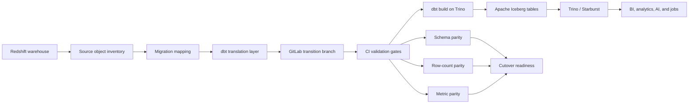
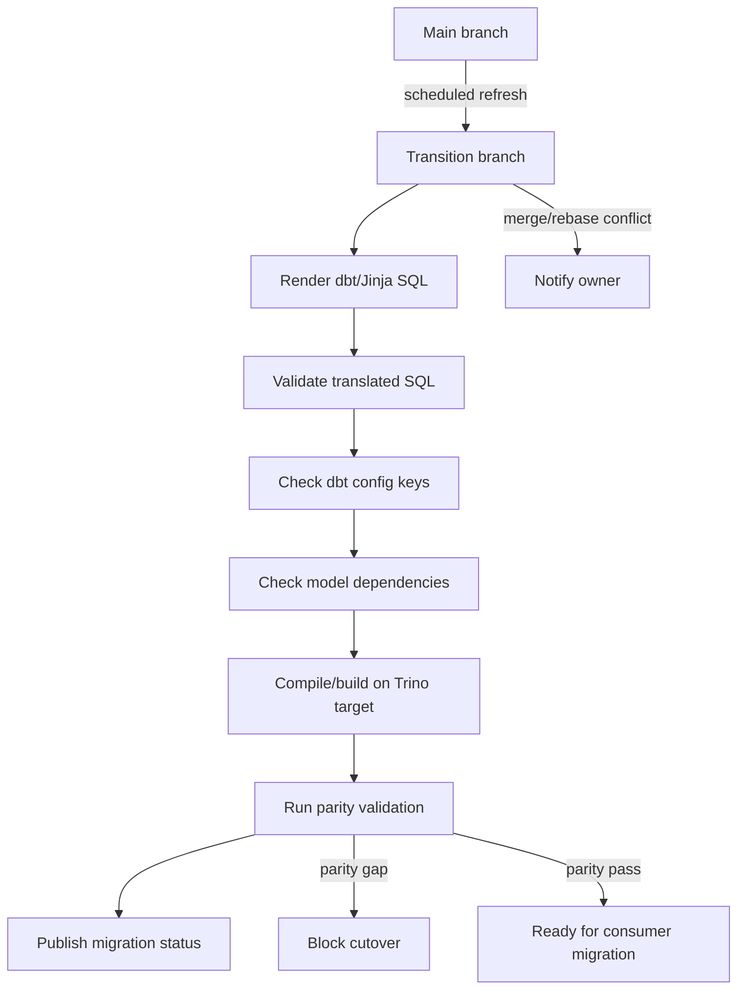

# Warehouse-to-Lakehouse Migration Technical Deep Dive

This repository documents the technical mechanics behind a large Redshift to
Trino/Starburst and Apache Iceberg migration. The slide deck tells the executive
story; this repository shows how the migration was organized, validated, and
cut over.

## Executive Summary

The migration moved a 200+ TB Redshift warehouse into an Apache Iceberg
lakehouse queried through Trino/Starburst. The hard part was not only moving
data. The hard part was keeping thousands of modeled objects, downstream
dependencies, and business metrics stable while the platform changed underneath
them.

The migration system had three parts:

1. A control plane that tracked which objects had moved.
2. A dbt translation layer that converted Redshift-oriented code to
   Trino/Iceberg-compatible code.
3. GitLab branch and CI controls that caught migration problems before merge.

## Impact

- Migrated a 200+ TB Redshift warehouse to a Trino/Starburst query layer backed
  by Apache Iceberg tables.
- Replatformed 2,000+ dbt-modeled objects while preserving object-level parity.
- Used a hot-swap cutover so existing BI, analytics, and downstream jobs did not
  need repeated repointing.
- Built shift-left controls so translation, branch freshness, dependency, and
  validation issues were caught before production users depended on the new
  lakehouse objects.
- Reduced platform cost by roughly 60% while keeping existing workflows stable.

## Files

| Area | Files |
| --- | --- |
| Translation engine | [translation-engine/dbt_jinja_processor.py](translation-engine/dbt_jinja_processor.py) |
| Transition branch automation | [gitlab-autorebase-transition-branch/transition_branch_refresh.py](gitlab-autorebase-transition-branch/transition_branch_refresh.py), [gitlab-autorebase-transition-branch/gitlab-ci.transition-branch-refresh.yml](gitlab-autorebase-transition-branch/gitlab-ci.transition-branch-refresh.yml) |
| Migration tracker | [tableau-migration-tracker/migration_tracker.sql](tableau-migration-tracker/migration_tracker.sql), [tableau-migration-tracker/Migration tracker.png](<tableau-migration-tracker/Migration tracker.png>) |

## Target Architecture



## Migration Tracker

The migration tracker created a single source of truth for object progress. It
joined the source warehouse/dbt inventory to the target Iceberg catalog and
classified each object as migrated, required but not migrated, or intentionally
held.

The tracker supported:

- progress by schema or folder,
- object-level cutover status,
- counts for dashboarding,
- prioritization of high-usage objects,
- exception handling for intentionally retired or on-hold objects.


The dbt model behind the tracker is
[migration_tracker.sql](tableau-migration-tracker/migration_tracker.sql).

## dbt Translation Layer

The code migration required more than changing the connection profile from
Redshift to Trino. The translation layer handled predictable differences:

| Redshift-oriented construct | Trino/Iceberg migration concern |
| --- | --- |
| `dist`, `sort`, `distribution` configs | Not valid or not useful for Trino/Iceberg |
| Redshift date functions | Function signatures differ in Trino |
| `::type` casts | Prefer explicit `CAST(expr AS type)` |
| warehouse-specific schemas | Need migration-aware source routing |
| table rebuild assumptions | Iceberg has snapshot and maintenance behavior |
| incremental model strategy | Adapter-specific merge/delete behavior differs |

The translation process:

1. Preserve `ref`, `source`, `var`, `dbt_utils`, and known project macros while
   cleaning the parts that are warehouse-specific.
2. Remove Redshift-only dbt config such as `dist`, `sort`, `distkey`, and
   `sortkey`.
3. Add or standardize target config where needed, such as converting selected
   models to Trino/Iceberg views.
4. Remove incremental-only SQL when the target object is intentionally rebuilt
   as a view.
5. Apply known Redshift-to-Trino SQL rewrites.
6. Parse and compile the result against the Trino target before cutover.

The cleanup script is
[dbt_jinja_processor.py](translation-engine/dbt_jinja_processor.py).

```bash
python translation-engine/dbt_jinja_processor.py models --materialized view
```

Use `--dry-run` to validate processing without writing files.

### Config Cleanup

Redshift models often contain physical layout config that does not apply to
Trino/Iceberg.

```jinja
{{ config(
    materialized='incremental',
    unique_key='payment_id',
    dist='company_id',
    sort=['created_at']
) }}
```

For Trino/Iceberg, the migrated model keeps logical behavior and removes
warehouse-specific physical layout keys:

```jinja
{{ config(
    materialized='incremental',
    unique_key='payment_id'
) }}
```

### Migration-Aware Source Routing

During transition, some objects may still read from the warehouse while others
read from the lakehouse. A small macro made that routing explicit.

```jinja

    
        {{ return(source('lakehouse', schema_name ~ '__' ~ table_name)) }}
    
        {{ return(source('warehouse', schema_name ~ '__' ~ table_name)) }}
    

```

Then models use the migration-aware relation:

```sql
SELECT
    payment_id,
    company_id,
    amount,
    created_at
FROM {{ migration_relation('finance', 'payments') }}
```

### Translation Matrix

Some rows are exact syntax translations. Others need model context, especially
window functions, JSON paths, array logic, and case-insensitive regular
expressions.

| Redshift | Trino | Notes |
| --- | --- | --- |
| `ADD_MONTHS(x, n)` | `DATE_ADD('month', n, x)` |  |
| `ARRAY(x, y, ...)` | `ARRAY[x, y, ...]` |  |
| `ARRAY(array) IS NOT NULL` | `ELEMENT_AT(FILTER(array, x -> x IS NOT NULL), 1) IS NOT NULL` | Checks whether at least one array element is non-null. |
| `ASCII(str)` | `CODEPOINT(str)` | `CODEPOINT()` returns a Unicode code point. |
| `BIT_AND()` | `BITWISE_AND()` plus `GROUP BY` | Usually needs a two-step aggregate rewrite. |
| `BOOL_OR()` | `SUM(CASE WHEN expression THEN 1 ELSE 0 END) > 0` | If any row evaluates true, return true; otherwise false. |
| `DATE(x) - DATE(y)` | `DATE_DIFF('day', DATE(y), DATE(x))` | Trino returns `end - start`; verify sign when translating date subtraction. |
| `DATEADD(day, x, y)` | `DATE_ADD('day', x, y)` |  |
| `DATEDIFF(day, x, y)` | `DATE_DIFF('day', x, y)` |  |
| `DATE_PART(x, y)` | `EXTRACT(x FROM y)` |  |
| `DATEPART(dow, createddate_pst) = 6` | `day_of_week(createddate_pst) = 6` | Saturday in both conventions. |
| `DATEPART(dow, createddate_pst) = 0` | `day_of_week(createddate_pst) = 7` | Redshift Sunday is `0`; Trino Sunday is `7`. |
| `DATE_PART(dayofweek, y)` | `CASE WHEN day_of_week(y) = 7 THEN 0 ELSE day_of_week(y) END` | Redshift returns `0` for Sunday through `6` for Saturday. Trino returns `1` for Monday through `7` for Sunday. |
| `DECODE()` | `CASE` statement |  |
| `DISTINCT ON (x)` | `DISTINCT` or window-function filter | Use full-row `DISTINCT`, or `ROW_NUMBER()` when the Redshift behavior depends on ordering. |
| `FLOAT` | `REAL` |  |
| `GETDATE()` | `CURRENT_TIMESTAMP` |  |
| `JSON_EXTRACT_ARRAY_ELEMENT_TEXT(json_str, index)` | `JSON_ARRAY_GET(json_str, index)` |  |
| `JSON_EXTRACT_PATH_TEXT(json_str, path)` | `JSON_EXTRACT(json_str, '$.path')` | Trino expects JSONPath syntax. |
| `LAST_DAY()` | `LAST_DAY_OF_MONTH()` |  |
| `LEFT(str, 1)` | `SUBSTRING(str, 1, 1)` |  |
| `LEN(str)` | `LENGTH(str)` |  |
| `LISTAGG(x, 'delimiter')` | `ARRAY_JOIN(ARRAY_AGG(x), 'delimiter')` | Add ordering explicitly if deterministic order matters. |
| `MEDIAN(x)` | `APPROX_PERCENTILE(x, 0.5)` | Approximate, not exact. |
| `MOD(number1, number2)` | `number1 % number2` |  |
| `NVL()` | `COALESCE()` | Returns the first non-null value. |
| `REGEXP_SUBSTR(string, pattern)` | `REGEXP_EXTRACT(string, pattern)` |  |
| `REGEXP_SUBSTR(x, 'pattern', y)` | `ELEMENT_AT(REGEXP_EXTRACT_ALL(x, 'pattern'), y)` | Use when the occurrence argument matters. |
| `PERCENTILE_CONT(percentile) WITHIN GROUP (ORDER BY expr)` | `APPROX_PERCENTILE(expr, percentile)` | Approximate percentile; verify if exact percentile is required. |
| `TRY_NUMERIC(x)` | `TRY(CAST(x AS REAL))` |  |
| `CHARACTER VARYING(x)` | `VARCHAR` |  |
| `IS_VALID_JSON(json_str)` | `TRY(JSON_PARSE(json_str)) IS NOT NULL` | Use `TRY(JSON_EXTRACT(json_str, '$.path'))` when validating a specific path. |
| `RIGHT(x, n)` | `SUBSTRING(x, -n)` |  |
| `SHA2(x, bits)` | `sha256(to_utf8(x))` | `sha256()` expects `varbinary` input. |
| `SUBSTR(str, start, end)` | `SUBSTRING(str, start, end)` |  |
| `SUPER` | `JSON` | `SUPER` is a Redshift proprietary data type. |
| `SPLIT_TO_ARRAY(x, delimiter)` | `SPLIT(x, delimiter)` |  |
| `x::BIGINT` | `CAST(x AS BIGINT)` | Trino does not support Redshift/Postgres-style `::` casts. |
| `str ~ pattern` | `REGEXP_LIKE(str, pattern)` |  |
| `str ~* pattern` | `REGEXP_LIKE(str, '(?i)' || pattern)` | `~*` is case-insensitive. |
| `TEXT` | `VARCHAR` |  |
| `TIMESTAMP 'epoch'` | `TIMESTAMP '1970-01-01 00:00:00'` |  |
| `TIMESTAMP 'epoch' + unixtime / 1000 * INTERVAL '1 second'` | `FROM_UNIXTIME(unixtime / 1000)` |  |
| `TO_CHAR(x, 'YYYY-MM')` | `DATE_FORMAT(x, '%Y-%m')` |  |
| `TO_DATE(x, 'MM/DD/YY')` | `DATE_PARSE(x, '%m/%d/%Y')` |  |
| `QUALIFY` | `ROW_NUMBER()` plus subquery | Replace `QUALIFY` with a nested query that filters on the window-function result. |
| `WITH RECURSIVE` | Manual rewrite | Replace recursion with an iterative staging model, seed table, date spine, or bounded expansion. |

## GitLab Transition Branch

The migration used a long-running transition branch to isolate platform changes
without freezing normal development. `main` continued to receive production
changes while the migration branch translated and validated models against the
lakehouse target.

The automation is in:

- [transition_branch_refresh.py](gitlab-autorebase-transition-branch/transition_branch_refresh.py)
- [gitlab-ci.transition-branch-refresh.yml](gitlab-autorebase-transition-branch/gitlab-ci.transition-branch-refresh.yml)



The key controls were:

- scheduled branch refresh from `main`,
- conflict notifications when source and migration edits diverged,
- merge request branch freshness checks,
- compile and parse checks on changed SQL,
- config-key checks for adapter-specific drift,
- dependency checks to preserve dbt layering rules.
