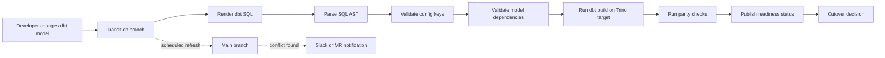

# Shift-Left Controls

Shift-left means moving migration risk earlier in the workflow. Instead of
waiting for production users to find broken queries, the migration process
checks code, dependencies, translated SQL, and data parity during development
and CI.

## Control Flow

## Branch Controls

The transition branch absorbs platform migration changes while the primary
branch remains available for normal development.

Useful checks:

- scheduled refresh from `main` into the transition branch,
- conflict notification with the files that need review,
- branch freshness check for merge requests,
- explicit `merge` or `rebase` strategy depending on team policy,
- protected variables for Git credentials and notification webhooks.

Example files:

- [../examples/transition_branch_refresh.py](../examples/transition_branch_refresh.py)
- [../examples/gitlab-ci.transition-branch-refresh.yml](../examples/gitlab-ci.transition-branch-refresh.yml)

## Translation Controls

Translation controls prevent Redshift-only assumptions from leaking into the
Trino/Iceberg target.

Examples:

- fail on unsupported dbt config keys such as Redshift distribution/sort keys,
- render dbt/Jinja before SQL parsing,
- require translated SQL to parse as a single valid statement,
- prefer explicit translation macros over ad hoc string replacement,
- route sources through a mapping table or macro while objects are migrating.

## Parity Controls

Parity controls prove that target objects are equivalent enough for cutover.

| Check | Purpose |
| --- | --- |
| Object parity | Every required source object exists in the target catalog |
| Schema parity | Required columns exist on both sides |
| Type parity | Compatible data types are normalized and compared |
| Row-count parity | Large differences are caught before consumer cutover |
| Metric parity | Business metrics are compared, not just physical rows |
| Missing-column risk | Missing target columns are scored based on source data presence |

## Why This Matters

For a 200+ TB migration, manual review does not scale. The value of the
shift-left approach is that migration quality becomes repeatable:

- developers get fast feedback,
- conflicts are surfaced before the transition branch drifts too far,
- invalid SQL is caught before deployment,
- parity gaps are visible before stakeholders are moved,
- cutover decisions are backed by evidence instead of confidence alone.
