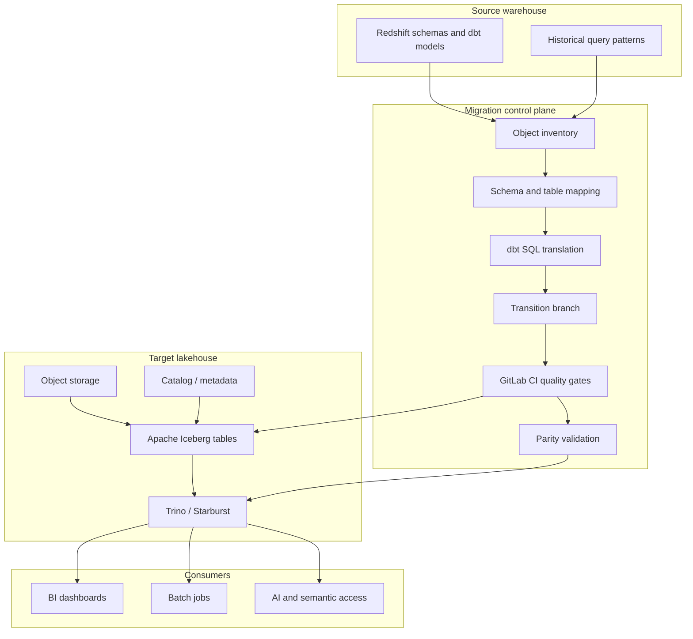

# Technical Deep Dive

## Executive Summary

The migration moved a large Redshift warehouse into an Apache Iceberg lakehouse
queried through Trino/Starburst. The hard part was not only moving data. The
hard part was keeping thousands of modeled objects, downstream dependencies,
and business metrics stable while the platform changed underneath them.

The migration system had four parts:

1. A control plane that tracked which objects had moved.
2. A dbt translation layer that converted Redshift-oriented code to
   Trino/Iceberg-compatible code.
3. GitLab branch and CI controls that caught migration problems before merge.
4. Automated parity checks that proved readiness before cutover.

## Target Architecture

## Migration Control Plane

The migration tracker created a single source of truth for object progress. It
joined the source warehouse/dbt inventory to the target Iceberg catalog and
classified each object as migrated or not migrated.

The tracker supported:

- progress by schema or folder,
- object-level cutover status,
- counts for dashboarding,
- prioritization of high-usage objects,
- exception handling for intentionally retired objects.

See [../examples/migration_tracker.sql](../examples/migration_tracker.sql).

## dbt Translation Layer

The code migration required more than changing the connection profile from
Redshift to Trino. A safer translation layer handled predictable differences:

| Redshift-oriented pattern | Trino/Iceberg migration concern |
| --- | --- |
| `dist`, `sort`, `distribution` configs | Not valid or not useful for Trino/Iceberg |
| Redshift date functions | Function signatures differ in Trino |
| `::type` casts | Prefer explicit `CAST(expr AS type)` |
| warehouse-specific schemas | Need migration-aware source routing |
| table rebuild assumptions | Iceberg has snapshot and maintenance behavior |
| incremental model strategy | Adapter-specific merge/delete behavior differs |

The translation layer was built around dbt/Jinja rendering, config governance,
and AST parsing:

- extract dbt `config(...)` keys and block unsupported Redshift-only config,
- render dbt models before parsing,
- parse generated SQL to catch translation failures,
- route source references through a migration mapping,
- standardize function/cast translation with explicit macros.

See [../examples/dbt_sql_translation.md](../examples/dbt_sql_translation.md).

## GitLab Transition Branch Strategy

The migration used a long-running transition branch to isolate platform changes
without freezing normal development. `main` continued to receive production
changes while the migration branch translated and validated models against the
lakehouse target.

The key controls were:

- scheduled branch refresh from `main`,
- conflict notifications when source and migration edits diverged,
- merge request branch freshness checks,
- compile and parse checks on changed SQL,
- config-key checks for adapter-specific drift,
- dependency checks to preserve dbt layering rules.

See [shift-left-controls.md](shift-left-controls.md) and
[../examples/transition_branch_refresh.py](../examples/transition_branch_refresh.py).

## Parity Validation

The validation layer was the evidence that the migration could be trusted. It
compared source and target objects before downstream consumers were moved.

Validation categories:

- object existence,
- column existence,
- data type compatibility,
- row-count parity,
- metric parity,
- missing-column risk based on non-null values,
- known-system-column exclusions.

The goal was to prove object parity before cutover, not discover issues after
dashboards or jobs had already moved.

See [../examples/parity_validation.py](../examples/parity_validation.py).

## Operational Follow-Through

After objects landed in Iceberg, the platform still needed maintenance and
observability:

- collect table statistics for Trino planning,
- monitor query usage and table access,
- identify stale or unused objects,
- run Iceberg maintenance such as snapshot expiration and file compaction,
- validate runtime behavior through Airflow/MWAA jobs.

This turns the migration from a one-time movement of data into a durable
lakehouse operating model.
